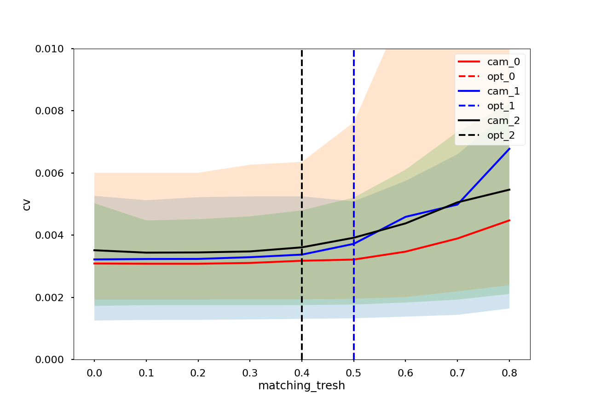
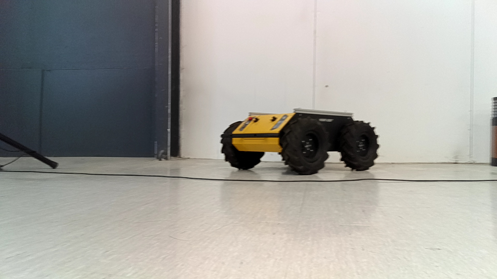
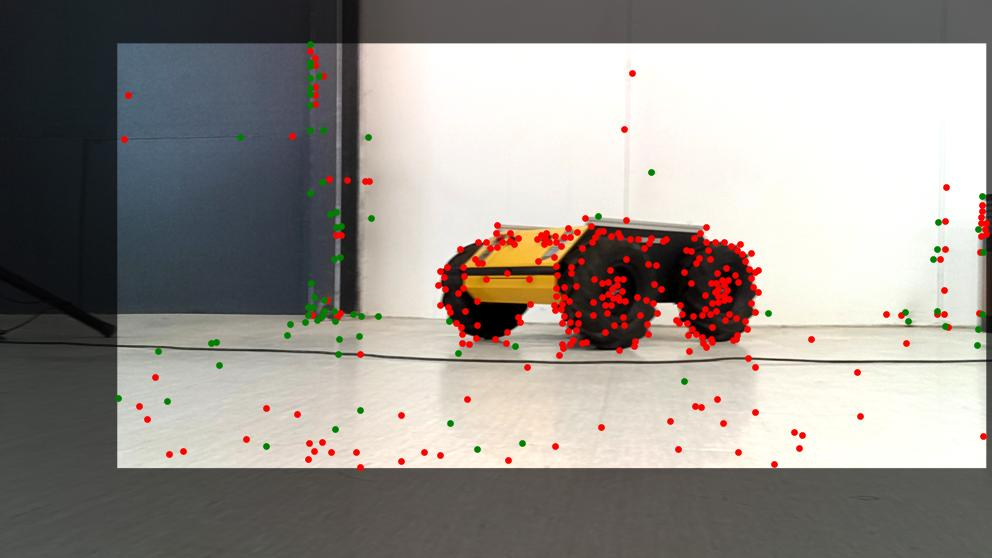
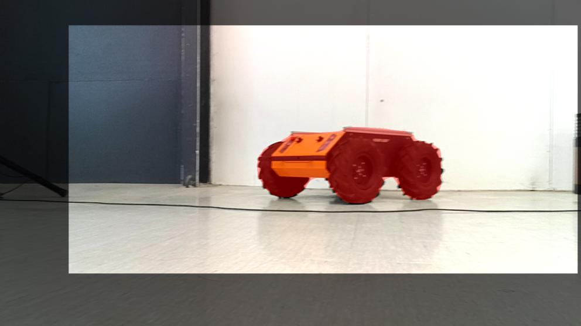
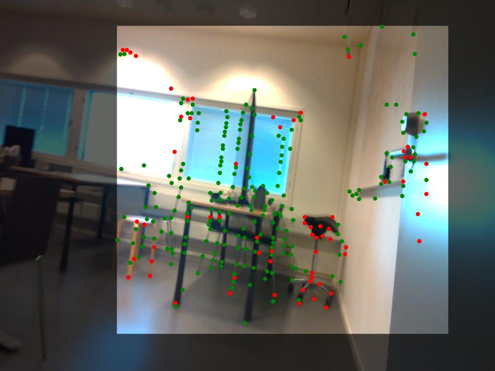
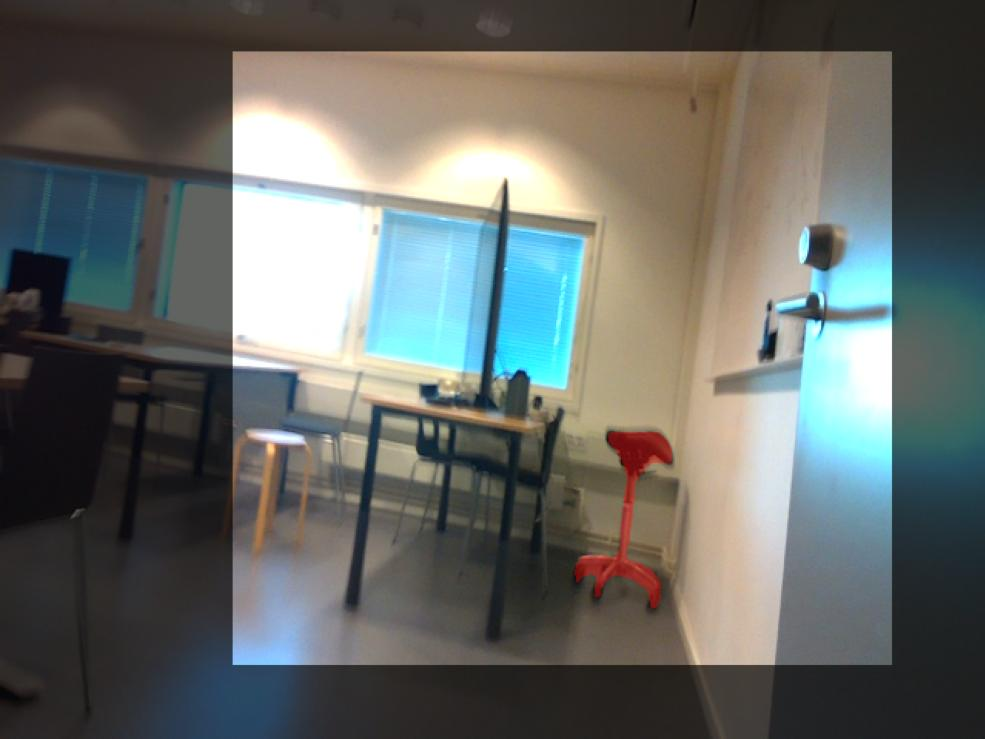
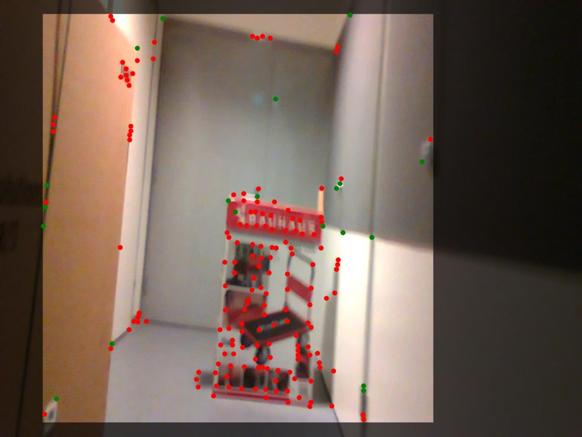
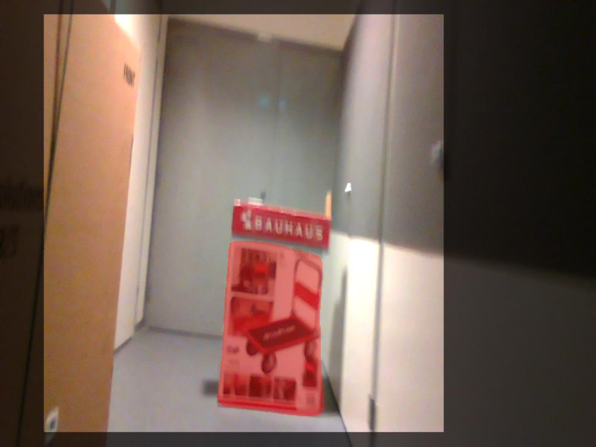
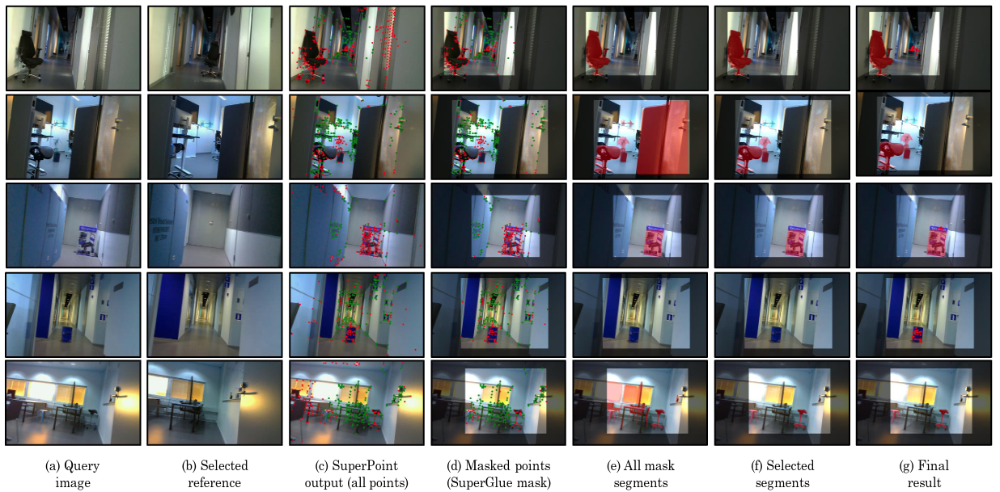

# Visual anomaly and change detection

Analysis of  Self-Calibrating Anomaly and Change Detection for Autonomous Inspection Robots

## Introduction

This work proposes a comprehensive deep learning framework for detecting anomalies and changes in a priori unknown environments after a reference dataset is gathered. We use the SuperPoint and SuperGlue feature extraction and matching and instance segmentation methods to detect anomalies based on reference images from a similar location. 

Full paper PDF: [Self-Calibrating Anomaly and Change Detection for Autonomous Inspection Robots](https://arxiv.org/pdf/2209.02379.pdf).

## How to run

   0. Clone repo
      ```
      git clone git@github.com:sahars93/Visual-Anomaly-and-Change-Dtecection-.git
      ```
   1. Install Detectron2 and Superpoint:
      ```
      cd Visual-Anomaly-and-Change-Dtecection-/
      git submodule update --init --recursive
      ```
   2. Run
      ```
      python3 final_anomaly_detection.py

## Self-Calibration

<div align=center>
  
  <p align="center">Calubration results for three different cameras</p>
</div>


## Results

Reference image            |  Query image            |  Feature extraction in overlap area            |  Final change detection        
:-------------------------:|:-------------------------:|:-------------------------:|:-------------------------: 
  |    |    |  

  |    |    |  

  |    |    |  


