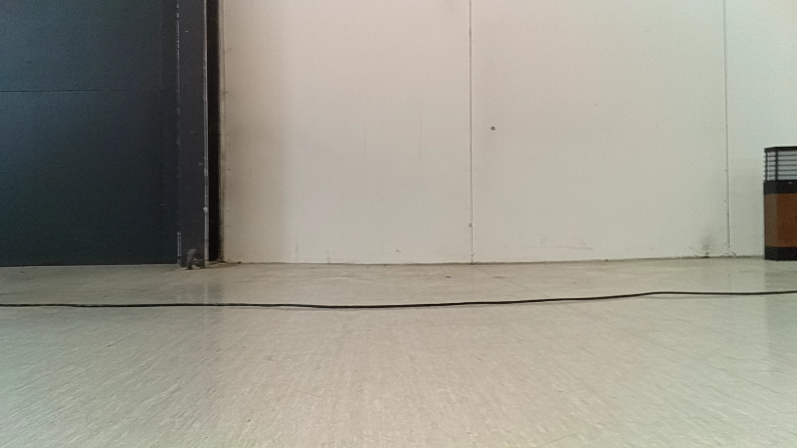
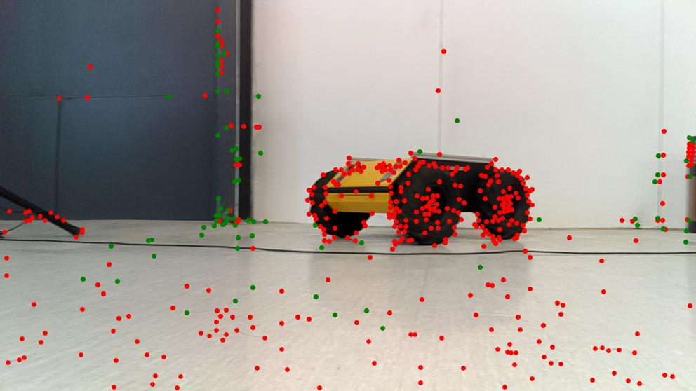

# Visual anomaly and change detection

Analysis of  Self-Calibrating Anomaly and Change Detection for Autonomous Inspection Robots

## Introduction

This work proposes a comprehensive deep learning framework for detecting anomalies and changes in a priori unknown environments after a reference dataset is gathered.
We use the SuperPoint and SuperGlue feature extraction and
matching and instance segmentation methods to detect anomalies based on reference images from a similar location. 

## Self-Calibration

We calibrated the SuperPoint and the SuperGlue models using a few-shot procedure since the number of matched and non-matched points varies depending on different thresholds. The appropriate thresholds should yield a low standard deviation of the distribution of distances between matched keypoint pairs.

## Results

  
   
  
  

